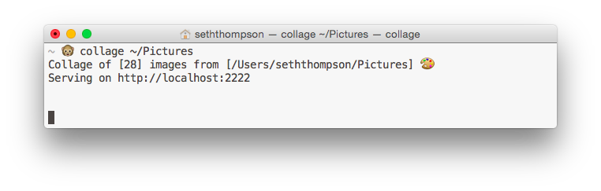

## Collage 

Simple CLI to serve random images from a folder as a collage.



### Installation

```
$ go get github.com/s3ththompson/collage
```

### Usage

```
collage [options...] [FOLDER]
Options:
	-n 	Number of images to display (randomly) from folder (default 100)
```

### Example

- Serve all the photos in my home directory

	```
	$ collage ~/
	Collage of [100] images from [/Users/seththompson] 🎨
	Serving on http://localhost:2222
	```
	
- Serve 10 random photos from my pictures

	```
	$ collage ~/Pictures -n 10
	Collage of [10] images from [/Users/seththompson/Pictures] 🎨
	Serving on http://localhost:2222
	```